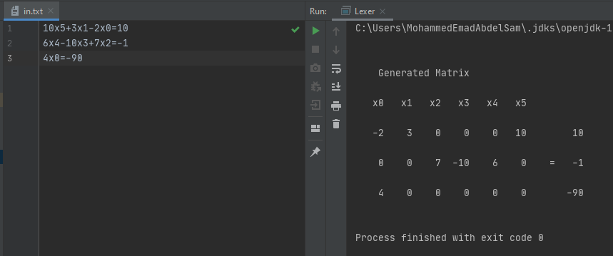

## LEXER - Compiler Course

This (Jlex & Java) program was our practical project to Compiler course.

### IDEA

the main idea is to put the equations on a Matrix form:

such as:

1x + 3y - 8z = 12

2y + z = 1

-x - 6y = 3

will be printed like this:

|x  |y   |z |    ||
|--- |--- |--- |--- |---
|1 |3 |-8 | |12
|0 |2 |1 |= |1
|-1 |-6 |0  | |3

###RUN

